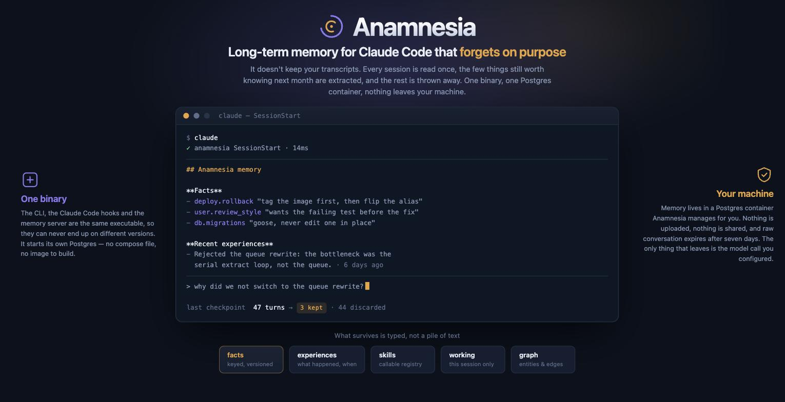

# Anamnesia



Long-term memory for Claude Code, running entirely on your own machine.

Anamnesia watches what you work on, keeps the parts that will still matter
next week, and hands them back at the start of your next session. So the
preference you explained once, the decision you made last month, and the
reason you rejected the obvious approach are all still there tomorrow.

One binary does everything: the CLI, the Claude Code hooks, and the memory
server. It manages its own Postgres container, so there is no compose file to
write and no image to build.

Nothing leaves your machine except the model calls you configure.

## What makes it different

**It does not store your conversations.** Most memory layers keep the
transcript and search it later. Anamnesia runs each checkpoint past a
surprise gate, asks a model what is worth keeping, and throws the rest
away. The default answer is "nothing" — `NOOP` — because most of what you
say to an assistant is noise. Raw content expires after seven days.

**Memory is typed, not a pile of text.** A preference is a `fact` with a
key you can update. A decision is an `experience` with a timestamp, an
abstraction level and participants. Relationships live in a bitemporal
`entities`/`edges` graph. That is what lets retrieval answer "what did we
decide and why" rather than returning five paragraphs that mention the
word.

**Facts have history.** Changing a value supersedes the old one instead
of overwriting it, so "what did I think last month" is answerable. Old
values stay out of your prompts unless you ask for them
(`include_history`).

**Failure is visible.** A health check that cannot fail is a green light
on a broken install, so `/v1/health` verifies the database, schema
version, embedding width and ANN indexes. Retrieval returns an error when
its embedder is down rather than an innocent-looking empty result. Hooks
never break a session, and every run is logged so `doctor` can tell you
which one has been failing silently for a week.

**It is measured, not asserted.** See below.

## Requirements

- **Docker**, for the Postgres container. Docker Desktop, OrbStack, colima
  and podman's docker shim all work.
- **Claude Code**, the client Anamnesia wires itself into.
- **macOS or Linux.**

Optionally, an **API key** for a model. Without one Anamnesia still runs, but
it extracts nothing: you get the plumbing and an empty memory.

## Getting started

### 1. Install the binary

Download it from the
[latest release](https://github.com/Flohs/anamnesia/releases/latest),
verify it, and put it on your PATH. Swap the asset name for your platform:
`anamnesia-darwin-arm64`, `anamnesia-darwin-amd64`, `anamnesia-linux-amd64` or
`anamnesia-linux-arm64`.

```bash
REPO=https://github.com/Flohs/anamnesia/releases/latest/download
curl -fsSLO $REPO/anamnesia-darwin-arm64
curl -fsSLO $REPO/checksums.txt
shasum -a 256 --check --ignore-missing checksums.txt
sudo install -m 0755 anamnesia-darwin-arm64 /usr/local/bin/anamnesia
```

Or build it yourself, which needs **Go 1.25.7+**:

```bash
git clone https://github.com/Flohs/anamnesia.git
cd anamnesia
sudo make install          # builds, then installs /usr/local/bin/anamnesia
```

Either way it needs to land somewhere permanent, because the hooks are wired
to the exact path you install it at. `make build` alone leaves it at
`./bin/anamnesia` if you would rather place it yourself.

### 2. Run setup

```bash
anamnesia setup
```

That is the whole installation. It creates your config, wires Claude Code,
installs tab completion for your shell, starts the database and the server,
and tells you whether it worked:

```
Setting up Anamnesia
  created ~/.anamnesia/config.toml
  wired 7 hooks in ~/.claude/settings.json
  wired MCP server in ~/.claude.json (http://127.0.0.1:8181/mcp)
  hooks call /usr/local/bin/anamnesia
  wrote zsh completion to ~/.anamnesia/completions/anamnesia.zsh (~/.zshrc updated)
    open a new shell, or `source ~/.zshrc`, to use it
  pulling pgvector/pgvector:pg16 (first run only, this can take a minute)
  creating container anamnesia-postgres on 127.0.0.1:5434
  waiting for postgres to accept connections
  server started (pid 88423, log ~/.anamnesia/server.log)

Your configuration
  file:  ~/.anamnesia/config.toml
  state: ~/.anamnesia
  ...

  ready on http://127.0.0.1:8181 (schema v11, embed stub/1536)
```

`setup` is idempotent. Run it again any time; it repairs whatever has drifted
and leaves your settings alone.

### 3. Give it a model

Until you do, `embed stub` in that last line means nothing gets extracted.
One OpenRouter key covers all three workloads (chat, embeddings, rerank):

```bash
anamnesia config set openrouter.api_key sk-or-v1-…
anamnesia restart
```

Direct provider keys work too, if you would rather not go through OpenRouter:

```bash
anamnesia config set anthropic.api_key sk-ant-…
anamnesia config set llm.provider anthropic
anamnesia config set openai.api_key sk-…      # for embeddings
anamnesia config set embed.provider openai
anamnesia restart
```

### 4. Check it, then use Claude Code

```bash
anamnesia doctor
```

```
  [ ok ] config      ~/.anamnesia/config.toml
  [ ok ] binary      /usr/local/bin/anamnesia (0.2.0)
  [ ok ] docker      engine 29.4.0
  [ ok ] postgres    container anamnesia-postgres running on 127.0.0.1:5434
  [ ok ] server      responding on http://127.0.0.1:8181
  [ ok ] schema      v11, vector(1536), database ok
  [ ok ] queue       0 sources awaiting extraction, 0 rows awaiting embedding
  [ ok ] hooks       7 entries in ~/.claude/settings.json
  [ ok ] mcp         http://127.0.0.1:8181/mcp
  [ ok ] completion  ~/.anamnesia/completions/anamnesia.zsh
  [warn] hook runs   no hook has run yet
                     → start a Claude Code session, then re-run this
```

`doctor` exits non-zero when any check fails, so you can put it in a script.
`anamnesia doctor --deep` also writes and reads back a memory, which exercises
the exact path your sessions use.

Now open Claude Code and work normally. Memory accumulates from your sessions,
so the first one has nothing to recall and later ones do. That last warning
clears once a session has run.

## Configuring

Everything lives in one commented file. Edit it directly, or drive it from
the CLI:

```bash
anamnesia config                       # every setting, its value, and where it came from
anamnesia config path                  # where the file is
anamnesia config edit                  # open it in $EDITOR
anamnesia config get llm.provider
anamnesia config set embed.dims 3072
```

Invalid values are rejected when you set them, rather than silently falling
back to a default later. API keys and passwords are masked in output unless
you pass `--show-secrets`.

The settings you are most likely to touch:

| Setting | Default | What it does |
|---|---|---|
| `openrouter.api_key` | _unset_ | One key fronts chat, embeddings and rerank. Setting it switches all three providers to `openrouter`. |
| `llm.provider` | auto | `anthropic`, `openai`, `openrouter` or `stub`. Auto-picks `openrouter` when the key above is set, otherwise `stub`. |
| `llm.model` | per provider | Leave empty for a sensible default. |
| `embed.provider` | auto | `openai`, `openrouter` or `stub`. |
| `embed.dims` | `1536` | Must match your embedding model. Changing it needs `anamnesia migrate --dims N`. |
| `rerank.provider` | auto | `cohere` or `openrouter`. Costs latency, buys precision. |
| `identity.user` | your username | Who memories belong to. |
| `server.addr` | `127.0.0.1:8181` | Loopback by default. Anything else should have `server.token` set too. |
| `server.autostart` | `true` | Let hooks start the stack when it is not running. |
| `postgres.port` | `5434` | Host port for the managed container. |
| `postgres.url` | _unset_ | Use your own Postgres instead, and Anamnesia manages no container. |

Environment variables (`ANAMNESIA_*`, `OPENROUTER_API_KEY`, and so on)
override the file, and command-line flags override those.

### Per project, and per person

Memories are filed under a project slug, which defaults to your git
repository's directory name. Pin it for one repository by writing
`.anamnesia.toml` at its root:

```bash
anamnesia init
```

That detects the slug from the directory, writes the file with the other
per-project settings documented alongside it, and refuses to overwrite one
that already exists. The file is meant to be committed, so it never holds
API keys or passwords. To change a single key later:

```bash
anamnesia config --project set identity.project my-service
```

Retrieval prefers the current project but also surfaces a small number of
relevant hits from your other projects, so a decision made elsewhere still
finds you.

For a small team sharing one server, give each person a distinct
`identity.user`. Memory partitions by user automatically.

## Commands

```
anamnesia setup      create the config, wire Claude Code, start the stack
anamnesia init       write .anamnesia.toml for the current repository
anamnesia start      start the postgres container and the server
anamnesia stop       stop the server (--all also stops postgres)
anamnesia restart    restart the server, e.g. after changing a setting
anamnesia status     what is running (--json for scripts)
anamnesia logs       the server log (-f to follow, -n to change how much)
anamnesia doctor     verify the install (--json, --deep)
anamnesia artifacts  the pages Claude Code published (backfill reads old ones)
anamnesia config     read and write settings
anamnesia update     update the binary and reconcile the install (--check to look)
anamnesia migrate    apply migrations (--dims rebuilds the vector columns)
anamnesia install    (re)wire Claude Code only
anamnesia uninstall  remove the wiring (--purge also deletes stored memory)
```

### Artifacts

Every page Claude Code publishes to claude.ai is recorded as it is made,
with its URL, what it was, which project it belonged to, and the readable
text of the page. Subagents are included: tool hooks fire inside them, so
a page an agent published is captured like any other. A prompt that
matches one is offered it alongside the answer; `anamnesia artifacts`
lists them.

```
$ anamnesia artifacts
2026-08-21 16:56  zeroploy      Blueprint Update Paths
                  https://claude.ai/code/artifact/2b8f…
```

Artifacts published before this existed are still in your transcripts.
`anamnesia artifacts backfill` reads them out. Most recover as a pointer
without the page text, because a published file lives in a session
scratchpad that gets cleaned up. It is idempotent, so it is also the
repair path if the server was down when something was published.

`retrieval.artifact_max_distance` (default 0.60) is how close a match has
to be before a link is put in front of you. Set it to 0 to keep the
listing and stop the prompt-driven surface.

### Tab completion

`setup` and `install` write a completion script for your shell and add one
line to `~/.zshrc` or `~/.bashrc` to source it (fish needs no line: it loads
its completions directory itself). The rc file is backed up first, and
`anamnesia uninstall` takes the line out again.

It completes commands and flags, and the values that go with them: every
setting `config set` accepts, the values an enum or a boolean setting allows,
and the project slugs you actually have.

```
$ anamnesia config set embed.<TAB>
embed.provider  -- Vector embeddings for retrieval
embed.model     -- Leave empty for the provider default
embed.dims      -- Embedding width

$ anamnesia config set rerank.provider <TAB>
none  cohere  openrouter
```

The script only calls `anamnesia __complete`, so it never goes stale: new
commands and new settings come from whichever binary is on your `PATH`, and
upgrading does not need it rewritten. Pass `--no-completion` to `setup` or
`install` to skip the whole step and leave your shell config alone.

## Updating

```bash
anamnesia update
```

That updates itself. It compares your build against the latest GitHub release
and, when a newer one exists, downloads that release's binary for your
platform, checks its SHA-256 against the `checksums.txt` published alongside
it, confirms the downloaded binary runs and reports the version it claims to
be, and only then replaces itself. The rest of the update is handed to the new
binary, so the version written into your hooks and the code enforcing the
schema are the version that will actually serve.

Then it re-points the hooks at the binary, refreshes the hook set, pulls the
database image, applies migrations, restarts the server, and runs a health
check. Every step is idempotent.

```bash
anamnesia update --check           # is there a newer release? change nothing
anamnesia update --pre             # include prereleases, not just stable ones
anamnesia update --no-self-update  # reconcile this binary, download nothing
```

Updates follow stable releases only. Prereleases are opt-in per run with
`--pre`, and `--check` tells you when one is available that you are not
being offered.

If the binary lives somewhere you do not own, such as `/usr/local/bin`, run
`anamnesia update` normally: it downloads and verifies as you, then asks
before escalating the one step that needs it.

```
  /usr/local/bin belongs to root, so the swap needs your password.
  Install it with sudo? [y/N]:
```

Answering yes runs a single `sudo install` of the already-verified file.
Everything else stays as you.

Do not run `sudo anamnesia update`. It is refused, because it would write your
config, Claude Code's `settings.json` and `.claude.json`, and the server's pid
file as root, leaving you unable to write your own files. Use `--allow-root`
if you genuinely mean it. On a non-interactive terminal nothing is prompted:
it prints the instruction and exits, so scripts fail loudly instead of hanging
on a password.

A locally built binary reports a commit hash rather than a version, so
`update` will not silently replace it. Pass `--force` if you want the latest
release to overwrite your own build.

Because the CLI, the hooks and the server are one executable, they cannot end
up on different versions.

## When something is wrong

Start with `anamnesia doctor`. Every failure it reports names the command that
fixes it. Beyond that:

```bash
anamnesia status        # is the database up? is the server up?
anamnesia logs -n 100   # why did the server stop?
```

A few specific cases:

**The server will not start, and mentions `vector(N)`.** Your configured
`embed.dims` and the database schema disagree, which would make every
embedding write fail, so the server refuses to run rather than failing quietly
one write at a time. Either set `embed.dims` back, or rebuild the schema with
`anamnesia migrate --dims N`. Rebuilding discards stored vectors and
re-embeds them in the background; your facts and experiences are not lost.

**A port is already in use.** Change it and start again:

```bash
anamnesia config set postgres.port 5435   # or server.addr for the API port
anamnesia start
```

**Claude Code is not picking Anamnesia up.** Restart Claude Code, since it
reads hooks and MCP servers at startup. Then check `anamnesia doctor`, which
reports duplicated hooks, hooks pointing at a binary that no longer exists,
and an MCP URL that does not match your server.

**Nothing is being remembered.** Check `llm.provider` in
`anamnesia config`. With `stub` there is no model to extract anything.

**The database rejects your password.** This happens when a data volume
outlives the config that created it, because Postgres keeps the password from
when the volume was first initialised. Anamnesia detects it and fixes it
automatically; if it cannot, it explains your options.

## How it works

Anamnesia adds seven hooks to Claude Code:

| Hook | What it does |
|---|---|
| `SessionStart` | loads your facts and recent experiences into the session |
| `UserPromptSubmit` | retrieves what is relevant to this prompt |
| `PreCompact` | checkpoints the conversation before context is compacted |
| `SessionEnd` | checkpoints the conversation when the session ends |
| `Stop` | checkpoints mid-session once enough has accumulated |
| `SubagentStop` | records what a subagent concluded |
| `PostToolUse` | records a published artifact (matched to the `Artifact` tool) |

Checkpoints are incremental: each one sends only what was added since the
last, so a long session costs no more than a short one. Hooks never block or
break a session, and every run is recorded in `~/.anamnesia/hooks.log`, which
is how `doctor` can tell a working install from one whose hooks fail silently.

A checkpoint lands in a `sources` row. A background worker reads pending
sources, runs a cheap surprise gate, fetches similar existing memories, and
asks the model for `ADD_FACT`, `UPDATE_FACT`, `DELETE_FACT`,
`ADD_EXPERIENCE` or `NOOP` operations. The default is `NOOP`, because most
conversation is noise. Anamnesia does not save your conversations; it extracts
what matters and discards the rest. Raw content in `sources` expires after
seven days.

What survives lands in six typed domains:

- **facts**, keyed claims such as preferences and project configuration
- **experiences**, time-stamped narratives with an abstraction level
- **skills**, a registry of callable things
- **working memory**, in-session entries that expire
- **entities and edges**, a bitemporal graph for multi-hop questions
- **artifacts**, the pages Claude Code published, kept as links

Artifacts are the one thing that does not go through the gate above. The
URL is in the transcript either way, so nothing is at risk of being lost;
what a model would add is a judgement about whether it was interesting,
applied to an identifier that is either exactly right or useless. They are
recorded as they are made and never guessed at.

Facts are versioned rather than overwritten: a changed value supersedes
the previous one, which keeps its own text, provenance and embedding.

Retrieval fuses three channels with reciprocal-rank fusion — pgvector
similarity, Postgres full-text search, and a walk over the entity graph —
and optionally reranks the result. (On extracted memory the full-text
channel earns almost nothing; that is measured, and written down in
`CLAUDE.md` so nobody spends a day rediscovering it.) A decay worker recomputes
per-experience relevance hourly; a daily consolidation worker clusters similar
experiences and distills each cluster into one higher-abstraction record, so
memory gets shorter as it gets older rather than growing without bound.

Claude also gets an MCP tool surface (`anamnesia_search`,
`anamnesia_facts_upsert`, `anamnesia_experience_record` and more) so it can
read and write memory deliberately, not only through the hooks.

## Measured

Most memory projects ship a benchmark number and no way to reproduce it.
Anamnesia ships the harness, the corpus definition and the baseline, so
you can disagree with the number by re-running it.

`scripts/longmemeval/` runs [LongMemEval](https://github.com/xiaowu0162/longmemeval)
against a live stack. `--mode retrieval` scores retrieval directly against
each question's gold evidence sessions, with **no answerer and no judge**,
so a run costs one search per question and carries none of two models'
variance.

Two numbers, because they answer different questions
([full record](docs/longmemeval-retrieval-baseline.md)):

**Did the right memory come back?** 30 questions, 56 gold evidence
sessions, scored mechanically against gold ids with no model in the loop:

```
recall@5  0.956    recall@20  0.956    MRR  0.928

retrieved             54  (96.4%)
stored_not_retrieved   1        ← ranking missed it
answer_elsewhere       1        ← stored under the wrong source
answer_missing         0        ← extraction dropped it
not_stored             0        ← the session produced nothing
```

**Was the final answer right?** The same corpus, same questions, run
through `--mode end-to-end`: retrieve, let a model answer from the hits,
and grade it with LongMemEval's own judge prompts (ported verbatim,
including the separate one for abstention questions):

```
overall  14/30  (46.7%)      answerer and judge: gpt-4o

single-session-preference  2/2  100%
multi-session              5/8   63%
single-session-user        2/4   50%
temporal-reasoning         3/8   38%
single-session-assistant   1/3   33%
knowledge-update           1/5   20%
```

**The gap between 95.6% and 46.7% is the interesting part**, and it is
not a rounding error. Retrieval hands over the right memory almost every
time; the answer is still wrong more often than not. Here is a real
failure, in full:

> **Question** Where do I currently keep my old sneakers?
> **Gold** in a shoe rack in my closet
> **Anamnesia** in a shoe rack
> **Judge** No.

Retrieval was perfect: the gold session came back ranked third, as
`user.organizing.shoe_rack → "store old sneakers in a shoe rack"`.
Extraction had dropped *"in my closet"*. The word appears in 14 raw
sources and survives in exactly one unrelated fact.

So on this corpus **retrieval is close to solved and extraction fidelity
is not.** Facts get captured but lose their qualifiers, and a memory that
says "in a shoe rack" when you asked *where* something is has lost the
useful half. That is a different problem from facts being dropped
entirely, which segmentation fixed.

Neither number is comparable to what memory vendors publish. Those are
over all 500 LongMemEval questions with their own answerer; this is a
30-question subset. For rough context, independent harnesses put
established products in the 49–59% range on the full set. The point here
is not the score — it is that the measurement says *where* the loss
happens, and it said extraction when every instinct said retrieval.

The evidence breakdown is what makes this useful. A score alone says a
question failed; these categories say *which subsystem* failed, and they
have repeatedly pointed somewhere other than where the guess would have
gone:

- a benchmark that reported "ranking missed it" when extraction had
  never stored the answer at all
- provenance quietly reassigned, so a session about a play owned a fact
  about a bike
- an embedder outage that looked exactly like an empty memory
- a full-text channel returning zero rows for every query, for months

Every one of those was found by the measurement rather than by reading
the code, and each is fixed with a test that fails without the fix. The
corpus behind the numbers: 8,560 sources, **zero extraction failures**,
13,633 facts plus 465 superseded ones.

Re-scoring a stored corpus takes about 25 seconds and no model calls:

```bash
python scripts/longmemeval/harness.py --dataset ./data/longmemeval_s_cleaned.json \
  --mode retrieval --skip-ingest --retrieve-k 20 --out ./out/rescore.jsonl
```

## What lives where

```
~/.anamnesia/
  config.toml     the only file you edit
  server.log      the server's output
  server.pid      the running server
  start.lock      guards concurrent auto-starts
  hooks.log       one line per hook run, which is what doctor reads
  offsets/        how far each session's transcript has been read
  completions/    the tab-completion script your shell sources
```

Anamnesia reads Claude Code's transcripts under `~/.claude/projects` and
never writes there.

Your memory itself lives in the Docker volume `anamnesia-pgdata`, so it
survives restarts, upgrades and `anamnesia uninstall`. Removing that volume
deletes everything, which is what `anamnesia uninstall --purge` does on
purpose.

Anamnesia also adds its hook entries to `~/.claude/settings.json`, its MCP
entry to `~/.claude.json`, and one line to `~/.zshrc` or `~/.bashrc` for tab
completion, backing each up before it first touches it. `anamnesia uninstall`
removes exactly those entries and leaves the rest alone.

See [SECURITY.md](SECURITY.md) for what is stored, what leaves your machine,
and what to change before exposing the server beyond loopback.

## Development

```bash
make build    # ./bin/anamnesia
make lint     # what CI enforces: gofmt, vet, tests
make test
make release  # cross-compile into ./dist
```

Anamnesia is a single Go module. `cmd/anamnesia` is the CLI, the hooks and the
server; `internal/` holds the store, retrieval, extraction and workers.

[CONTRIBUTING.md](CONTRIBUTING.md) covers working against a throwaway install
so you never test against your own memory, and the invariants worth not
breaking. [CHANGELOG.md](CHANGELOG.md) records what has changed.

## License

MIT. See [LICENSE](LICENSE).
